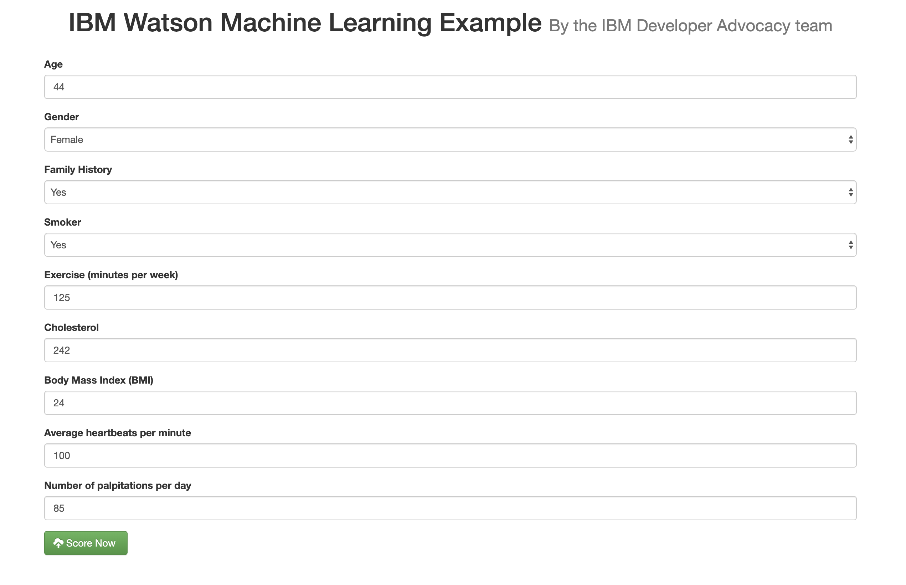
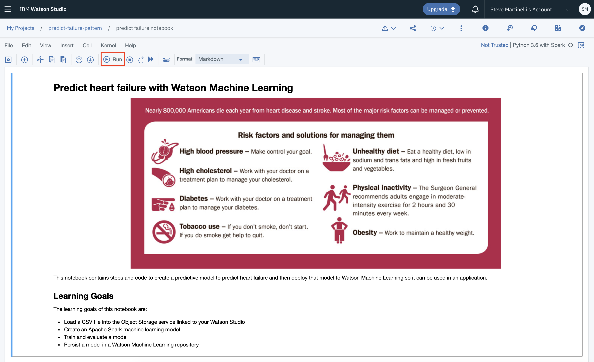
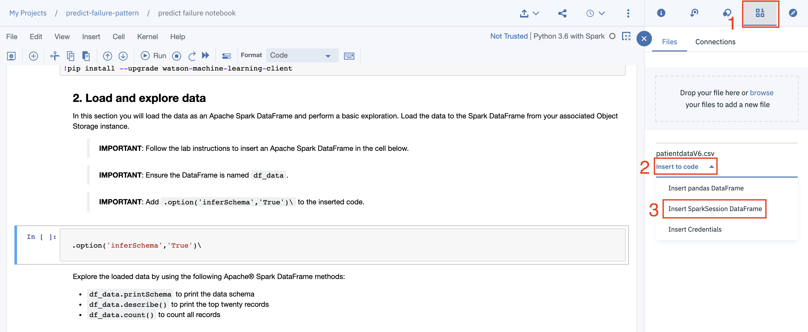

# Deploy a model to predict heart failure with Watson Machine Learning

> **DISCLAIMER**: This application is used for demonstrative and illustrative purposes only and does not constitute an offering that has gone through regulatory review.

This code pattern can be thought of as two distinct parts:

1. A predictive model will be built using Spark within a Jupyter Notebook on IBM Watson Studio. The model is then deployed to the Watson Machine Learning service, where it can be accessed via a REST API.

2. A Node.js web app that allows a user to input some data to be scored against the previous model.

When the reader has completed this Code Pattern, they will understand how to:

* Build a predictive model within a Jupyter Notebook on Watson Studio
* Deploy the model to the IBM Watson Machine Learning service
* Via a Node.js app, score some data against the model via an API call to the Watson Machine Learning service

**Sample output**

Here's an example of what the final web app looks like

And it's result

## Architecture

1. The developer creates an IBM Watson Studio Workspace.
2. IBM Watson Studio uses an Apache Spark service.
3. IBM Watson Studio uses Cloud Object storage to manage your data.
4. IBM Watson Studio uses a Jupyter Notebook to import data, train, and evaluate their model.
5. Data is imported and stored on Cloud Object Storage.
6. Models trained via Jupyter Notebooks are deployed using the Watson Machine Learning service.
7. A Node.js web app is deployed on IBM Cloud, it calls the predictive model hosted on the Watson Machine Learning service.
8. A user visits the web app, enters their information, and the predictive model returns a response.

## Included components

* [IBM Watson Studio](https://www.ibm.com/cloud/watson-studio): Analyze data using RStudio, Jupyter, and Python in a configured, collaborative environment that includes IBM value-adds, such as managed Spark.
* [Jupyter Notebook](https://jupyter.org/): An open source web application that allows you to create and share documents that contain live code, equations, visualizations, and explanatory text.
* [PixieDust](https://github.com/pixiedust/pixiedust): Provides a Python helper library for IPython Notebook.
* [Node.js](https://nodejs.org/): An open-source JavaScript run-time environment for executing server-side JavaScript code.

## Prerequisites

* An [IBM Cloud Account](https://cloud.ibm.com)
* An account on [IBM Watson Studio](https://dataplatform.cloud.ibm.com/).

> **NOTE**: As of 10/16/2020, the Watson Machine Learning service on IBM Cloud is only available in the Dallas, London, Frankfurt, or Tokyo regions. Not the Seoul, Frankfurt, or Sydney regions.

## Steps

1. [Setup project and data in Watson Studio](#1-setup-project-and-data-in-watson-studio)
   * [Create a project in Watson Studio](#11-create-a-project-in-watson-studio)
   * [Add patient data as an asset](#12-add-patient-data-as-an-asset)
   * [Provision a Watson Machine Learning service](#13-provision-a-watson-machine-learning-service)
   * [Create a notebook in Watson Studio](#14-create-a-notebook-in-watson-studio)
1. [Create and deploy a predictive model with Watson Studio](#2-create-and-deploy-a-predictive-model-with-watson-studio)
   * [Start stepping through the notebook](#21-start-stepping-through-the-notebook)
   * [Save the model](#22-save-the-model)
   * [Deploy the model](#23-deploy-the-model)
1. [The client side](#3-the-client-side)
   * [Deploy the web app](#31-deploy-the-web-app)
   * [Bind the app with the existing Maching Learning service](#32-bind-the-app-with-the-existing-maching-learning-service)
   * [Interacting with the web app](#33-interacting-with-the-web-app)

### 1. Setup project and data in Watson Studio

To complete this code pattern we'll need to do a few setup steps before creating our model. In Watson Studio we need to: create a project, add our patient data (which our model will be based on), upload our notebook, and provision a Watson Machine Learning service.

#### 1.1. Create a project in Watson Studio

* Log into IBM's [Watson Studio](https://dataplatform.cloud.ibm.com). Once in, you'll land on the dashboard.

* Create a new project by clicking `+ New project` and choosing `Data Science`:

   

* Enter a name for the project name and click `Create`.

> **NOTE**: By creating a project in Watson Studio a free tier `Object Storage` service will be created in your IBM Cloud account. Select the `Free` storage type to avoid fees.

#### 1.2 Add patient data as an asset

The data used in this example was generated using a normal distribution. Attributes such as age, gender, heartrate, minutes of exercise per week, and cholesterol are used to create the model we will eventually deploy.

* From the new project `Overview` panel, click `+ Add to project` on the top right and choose the `Data` asset type.

   

* A panel on the right of the screen will appear to assit you in uploading data. Follow the numbered steps in the image below.

  * Ensure you're on the `Load` tab. [1]
  * Click on the `browse` option. From your machine, browse to the location of the [`patientdataV6.csv`](data/patientdataV6.csv) file in this repository, and upload it. [not numbered]
  * Once uploaded, go to the `Files` tab. [2]
  * Ensure the `patientdataV6.csv` appears. [3]

   

* **TIP:** Once successfully uploaded, the file should appear in the `Data assets` section of the `Assets` tab.

   

#### 1.3 Provision a Watson Machine Learning service

* Click on the navigation menu on the left (`☰`) to show additional options. Click on the `Watson Services` option.

   

* From the overview page, click `+ Add service` on the top right and choose the `Machine Learning` service. Select the `Lite` plan to avoid fees.

* Once provisioned, you should see the service listed in the `Watson Services` overview page. **Select the service by opening the link in a new tab.**  We're now in the IBM Cloud tool, where we will create service credentials for our now Watson Machine Learning service. Follow the numbered steps in the image below. **We'll be using these credentials in Step 2, so keep them handy!**.

   

* **TIP:** You can now go back the project via the navigation menu on the left (`☰`).

   

#### 1.4 Create a notebook in Watson Studio

The notebook we'll be using can be viewed in [`notebooks/predictiveModel.ipynb`](notebooks/predictiveModel.ipynb), and a completed version can be found in [`examples/exampleOutput.ipynb`](examples/exampleOutput.ipynb).

* From the new project `Overview` panel, click `+ Add to project` on the top right and choose the `Notebook` asset type. Fill in the following information:

  * Select the `From URL` tab. [1]
  * Enter a `Name` for the notebook and optionally a description. [2]
  * Under `Notebook URL` provide the following url: [https://github.com/IBM/predictive-model-on-watson-ml/blob/master/notebooks/predictiveModel.ipynb](https://github.com/IBM/predictive-model-on-watson-ml/blob/master/notebooks/predictiveModel.ipynb) [3]
  * For `Runtime` select the `Spark Python 3.6` option. [4]

  

* **TIP:** Once successfully imported, the notebook should appear in the `Notebooks` section of the `Assets` tab.

  

### 2. Create and deploy a predictive model with Watson Studio

Now that we're in our Notebook editor, we can start to create our predictive model by stepping through the notebook.

#### 2.1 Start stepping through the notebook

* Click the `(►) Run` button to start stepping through the notebook.

* When you reach the cell entitled *2. Load and explore data* pause and follow the instructions in that cell. On the very next cell we need to add our data. Follow the numbered steps in the image below.

  

  * Click on the `Data` icon. [1]
  * Select the `Insert to code` option under the file **patientdataV6.csv**. [2]
  * Choose the `Insert SparkSession Data Frame` option. [3]

  

* The above step will have inserted a chunk of code into your notebook. We need to make two changes:

  * Rename the `df_data_1` variable to `df_data`. [1]
  * Re-add the line `.option('inferSchema','True')\` to the `spark.read()` call. [2]

  

* Keep stepping through the code, pausing on each step to read the code and see the output for the opertion we're performing. At the end of *Step 4* we'll have used the [Random Forest Classifier from PySpark](https://spark.apache.org/docs/2.1.0/ml-classification-regression.html#random-forest-classifier) to create a model **LOCALLY**.

   

#### 2.2 Save the model

The gist of the next two steps is to use the [Watson Machine Learning Python client](https://wml-api-pyclient.mybluemix.net/) to persist and deploy the model we just created.

* At the beginning of Step *5. Persist model*, before we deploy our model, we need up update the cell with credentials from our Watson Machine Learning service. (Remember that from [Step 1.3 Provision a Watson Machine Learning service](#13-provision-a-watson-machine-learning-service)?)

* Update the `wml_credentials` variable below. Copy and paste the entire credential dictionary, which can be found on the _Service Credentials_ tab of the Watson Machine Learning service instance created on the IBM Cloud.

   

* Keep stepping through the code, pausing on each step to read the code and see the output for the opertion we're performing. At the end of *Step 5* we'll have used the Watson Machine Learning service to persist our predictive model! :tada:

   

#### 2.3 Deploy the model

* Now let's run *Step 6* of the notebook. Deploy our model so we can have an endpoint to score data against.

  

Now that we have an API, let's create a client side interface that a typical user would interact with.

<!-- this only works if we associate the service with the project, make this optional

* **TIP:** Once successfully imported, the notebook should appear in the `Models` section of the `Assets` tab. It will likely be named `Heart Failure Prediction Model`.

    -->

### 3. The client side

#### 3.1 Deploy the web app

You can deploy this application as a Cloud Foundry application to IBM Cloud by simply clicking the button below. This option will create a deployment pipeline, complete with a hosted Git lab project and devops toolchain.

    

* You may be prompted for an *IBM Cloud API Key* during this process. Use the `Create (+)` button to auto-fill this field and the others.

   

* Click on the `Deploy` button to deploy the application.

* You can view the URL where the app will live by either waiting for the deployment to finish, or by finding your app from the [IBM Cloud dashboard](https://cloud.ibm.com/resources).  or Click on the application name, then choose `Visit App URL` from the `Overview` page to open the application in a separate tab.

   

#### 3.2 Bind the app with the existing Maching Learning service

* From the application's overview page, select the `Connections` option from the left menu panel. This will allow us to associate our Watson Machine Learning service with the application. Find the Watson Machine Learning service (likely prefixed with `pm-20`), click the `Connect` button, and choose the default options for the IAM generated credentials. and select the Watson Machine Learning service you provisioned earlier.

  

* When prompted to restage your application click the `Restage` button. The app will take a couple of minutes to come back online. Refresh any web pages that have the app running.

> *Why do this?* The application is expecting information about the Maching Learning service via environment variables. By associating the application with the service, details about the service, such as the deployment id, and other sensitive information are accessible through environment variables.

#### 3.3 Interacting with the web app

The app is fairly self-explantory, simply fill in the data you want to score and click on the `Score now` button to test how those figures would score against our model.

* Verify that the model predicts that there is a risk of heart failure for the patient with these medical characteristics.

   

* Verify that the model predicts that there is not a risk of heart failure for the patient with these medical characteristics.

   

## License

This code pattern is licensed under the Apache Software License, Version 2.  Separate third party code objects invoked within this code pattern are licensed by their respective providers pursuant to their own separate licenses. Contributions are subject to the [Developer Certificate of Origin, Version 1.1 (DCO)](https://developercertificate.org/) and the [Apache Software License, Version 2](http://www.apache.org/licenses/LICENSE-2.0.txt).

[Apache Software License (ASL) FAQ](http://www.apache.org/foundation/license-faq.html#WhatDoesItMEAN)
